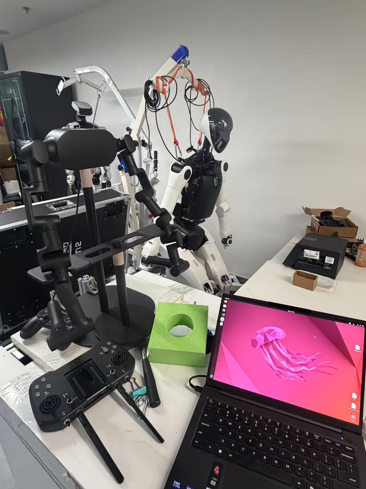
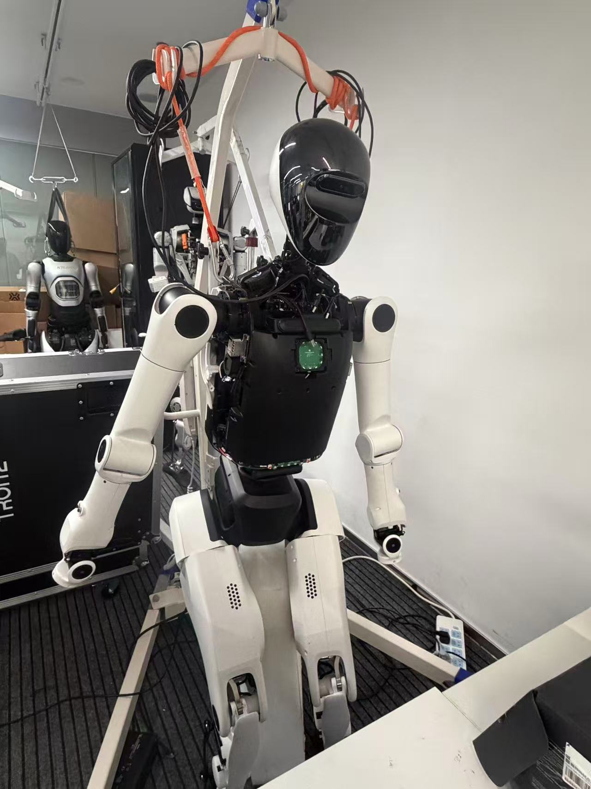
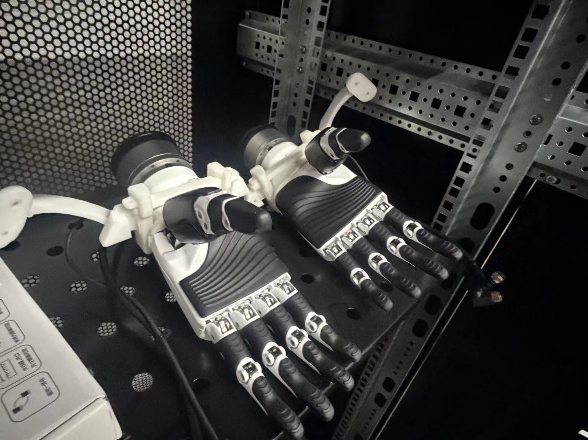

# Tienkung VLA Collect Data

本项目提供一套面向天工 2.0 PRO 机器人的 VLA 数据采集流程。系统使用同构遥操作臂进行人工示教，以固定 `20Hz` 同步保存三路 RGB 图像、双臂 command、双臂 state，以及末端执行器 state/command。当前支持两类末端：

- 因时 6 自由度灵巧手：左右手各保存 6 维关节状态。
- 双夹爪：左右夹爪各保存 1 维开合状态，话题可按自己的机器人配置传入。

采集结果保存为按 episode 编号组织的 PNG 图像序列和 `arm.npz`，方便后续转换为 LeRobot/OpenPI 等训练格式。



## 系统组成

本仓库假设你有一套多机 ROS 2 采集系统，设备角色可以按自己的硬件调整：

- 天工 2.0 PRO 机器人本体，双臂末端可安装 6 自由度灵巧手或夹爪。
- 同构遥操作臂，用于人工示教并产生机械臂 command。
- 上位机，用于运行遥操作软件、启动/停止机器人侧节点，并保存最终数据集。
- 机器人 x86 控制机，用于发布机械臂、头部和末端执行器 ROS 2 话题。
- 采集 AGX，用于本地订阅三路图像和状态话题，并把数据先写入 `/dev/shm`。
- 相机 AGX，用于连接左右手腕相机，并发布左右手视角图像。





## 为什么使用 h264 图像话题

三路相机同时跨设备传输时，未压缩 RGB 图像会占用较高网络带宽，容易导致远端订阅阻塞、丢帧或写盘线程堆积。本项目默认让左右 D405 手部相机发布 h264 压缩视频话题：

- 头部相机：`/camera/color/image_raw/compressed`
- 左手相机：`/camera/d405_left/color/image_h264`
- 右手相机：`/camera/d405_right/color/image_h264`

采集器只在回调中缓存最新原始消息，固定频率保存线程再解码并写成 PNG。这样可以降低 ROS 队列堆积风险，同时让训练数据仍保持普通 PNG 序列格式。

如果你的网络和主机性能足够，也可以把图像话题改成 `sensor_msgs/msg/Image` 或 `sensor_msgs/msg/CompressedImage`，并通过 `--*-image-type` 参数指定消息类型。

## 快速开始

推荐在采集 AGX 上本地录制，避免上位机跨设备订阅三路图像时因为带宽或 CPU 解码压力出现阻塞。下面命令中的路径和主机名来自本项目部署，你可以按自己的机器人和用户目录调整。

1. 在上位机项目目录启动相机节点：

```bash
cd /home/ubuntu/cbc_tienkung2.0_vla_collect_data
bash scripts/start_vla_nodes.sh --no-move-head
```

如果机器人还没有低头，并且确认周围安全，可以去掉 `--no-move-head`。

如果 D405 经常报找不到 USB 设备，先按下面的“D405 USB 恢复”处理，并把相机序列号替换成你自己的设备。

2. 采集前查看三路摄像头画面：

```bash
cd /home/ubuntu/cbc_tienkung2.0_vla_collect_data
python3 scripts/view_vla_cameras.py
```

如果当前终端没有图形界面，可以保存一张预览图：

```bash
python3 scripts/view_vla_cameras.py --save-preview /tmp/vla_preview.jpg
```

3. 在采集 AGX 项目目录开始采集：

脚本名中的 `n2` 是当前部署的历史命名，对外可理解为“采集 AGX”。如果你的采集主机不是这个名字，只需要保留脚本逻辑并修改路径或环境 source。

```bash
cd /home/nvidia/cbc_tienkung2.0_vla_collect_data
bash scripts/n2_dual_hands_collect.sh --target-hz 20
```

采集程序内输入：

- `1`：开始录制；如果相机或状态流还没就绪，会自动等待到齐后开始；如果缺相机流，会自动尝试恢复对应相机节点
- `2`：停止录制并保存本组数据；如果还在等待启动，会取消本次等待
- `3`：删除上一组数据
- `q`：退出脚本

采集 AGX 的项目代码建议放在持久目录中，重启不会清空；采集数据默认写入 tmpfs，减少磁盘写入压力：

```text
/dev/shm/cbc_tienkung2.0_vla_collect_data/vla_recorded_data/dual_hands
```

4. 在采集 AGX 上传到上位机并删除本地数据：

```bash
cd /home/nvidia/cbc_tienkung2.0_vla_collect_data
bash scripts/upload_n2_recorded_data.sh
```

上传目标目录为：

```text
/home/ubuntu/cbc_tienkung2.0_vla_collect_data/vla_recorded_data/dual_hands
```

5. 上位机也可以作为备用采集入口，但不建议在网络不稳定时长期使用：

```bash
cd /home/ubuntu/cbc_tienkung2.0_vla_collect_data
python3 scripts/dual_hands_collect.py --target-hz 20
```

## D405 USB 恢复

相机 AGX 上的 D405 偶尔会出现 `No RealSense devices were found`、`rs-enumerate-devices` 无设备、或者 `lsusb` 有设备但相机节点仍找不到设备的情况。优先使用下面的软件重置流程，不需要机器人动作。

1. 在上位机停止当前 VLA 节点：

```bash
cd /home/ubuntu/cbc_tienkung2.0_vla_collect_data
bash scripts/stop_vla_nodes.sh
tmux kill-session -t vla_camera_launch 2>/dev/null || true
```

2. 在相机 AGX 上重绑 USB 主控：

```bash
printf 'nvidia\n' | sudo -S bash -lc '
cd /sys/bus/platform/drivers/tegra-xusb
echo 3610000.usb > unbind
sleep 3
echo 3610000.usb > bind
sleep 8
lsusb
rs-enumerate-devices 2>/dev/null | grep -E "Name|Serial Number|Physical Port" || true
'
```

正常应能看到两台 `Intel RealSense D405`。下面是本项目实测设备的序列号，只作为示例；你需要用自己相机的 `Serial Number` 更新启动脚本或 launch 配置：

- `353322271022`
- `230322275908`

3. 重新启动节点：

```bash
cd /home/ubuntu/cbc_tienkung2.0_vla_collect_data
bash scripts/start_vla_nodes.sh --no-move-head
```

4. 确认三路相机画面：

```bash
python3 scripts/view_vla_cameras.py --save-preview /tmp/vla_preview.jpg
```

如果重绑后 `lsusb` 仍看不到两台 D405，需要现场重新插拔或重新给 D405 上电。

## 目录结构

- `cbc_tienkung_vla/collector.py`：公共采集器，维护各话题最新缓存，按固定 20Hz 保存快照；不作为命令行主入口。
- `scripts/dual_hands_collect.py`：双手采集程序，内部有独立 `main()`，直接运行这个文件。
- `scripts/gripper_vla_collect.py`：双夹爪采集程序，左右末端默认按 1 自由度 JointState 保存；夹爪话题暂留空，确认后用命令行参数传入。
- `scripts/view_vla_cameras.py`：三路相机预览脚本，用于采集前确认视角。
- `scripts/recover_vla_streams.sh`：相机流自动恢复脚本，采集器等待启动时可自动调用。
- `scripts/n2_dual_hands_collect.sh`：采集 AGX 的 tmpfs 采集入口，自动 source 机器人侧消息环境；脚本名中的 `n2` 是当前设备命名遗留。
- `scripts/upload_n2_recorded_data.sh`：把采集 AGX tmpfs 中的数据上传到上位机 `dual_hands/` 并删除本地副本；脚本名中的 `n2` 是当前设备命名遗留。
- `launch/vla_camera_nodes.launch.py`：推荐的一键启动入口，用独立进程启动每个远端相机节点。
- `scripts/start_vla_nodes.sh`：兼容包装，内部调用 `launch/vla_camera_nodes.launch.py`。
- `scripts/stop_vla_nodes.sh`：停止相机节点，便于重新启动。
- `examples/tienkung/convert_tienkung_data_to_lerobot.py`：把双 6 自由度灵巧手数据转换成 LeRobot 26 维数据集。
- `examples/tienkung/convert_tienkung_gripper_data_to_lerobot.py`：把双夹爪数据转换成 LeRobot 16 维数据集。
- `configs/`：运行参数示例。
- `assets/`：D405 手部相机支架图片和 STL 模型。
- `docs/skill/`：同步的 skill 文档和巡检参考资料。

## 推荐流程

1. 确认机器人已进入安全的 VLA 初始状态。
2. 使用 `bash scripts/start_vla_nodes.sh` 启动全部相机并默认低头；如果头已经低下去了，使用 `bash scripts/start_vla_nodes.sh --no-move-head`。
3. 检查图像、机械臂和灵巧手话题 publisher 与频率。
4. 稳定采集优先在采集 AGX 运行 `bash scripts/n2_dual_hands_collect.sh --target-hz 20`，终端输入 `1` 开始、`2` 停止、`3` 删除上一组、`q` 退出。
5. 采完后在采集 AGX 运行 `bash scripts/upload_n2_recorded_data.sh`，上传到上位机 `vla_recorded_data/dual_hands/` 并清理本机 tmpfs。
6. 查看每组三路 PNG 数量和 `arm.npz` 数组形状，确认图像、机械臂和手部状态已保存。

## 双手采集

```bash
cd /home/ubuntu/cbc_tienkung2.0_vla_collect_data
python3 scripts/dual_hands_collect.py
```

上位机已默认自动加载 `/opt/ros/humble/setup.bash`。如果换到其他主机运行，需要先 source 对应 ROS 2 环境。

常用参数：

```bash
python3 scripts/dual_hands_collect.py \
  --target-hz 20
```

当前默认图像输入为：

- 头部：`/camera/color/image_raw/compressed`，`sensor_msgs/msg/CompressedImage`
- 左手：`/camera/d405_left/color/image_h264`，`foxglove_msgs/msg/CompressedVideo`
- 右手：`/camera/d405_right/color/image_h264`，`foxglove_msgs/msg/CompressedVideo`

D405 默认沿用旧项目中已经稳定验证过的 h264 图像话题。采集器按 `20Hz` 固定保存当前最新缓存；新图像到来会替换缓存，没有新图像时允许复用上一帧，以保持固定训练采样频率。图像订阅使用 depth=1 best-effort，回调只缓存最新原始图像，PNG 解码和写盘放在保存线程中，避免旧图像在 ROS 队列里堆积。默认保存 PNG 保持相机输出尺寸，不做 resize；如需临时缩放可显式传 `--output-image-size 224`。

如果输入 `1` 后提示缺 `head`、`hand_left` 或 `hand_right`，采集器会每隔一段时间自动调用 `scripts/recover_vla_streams.sh` 恢复缺失相机流。也可以手动运行：

```bash
bash scripts/recover_vla_streams.sh head
bash scripts/recover_vla_streams.sh hand_left hand_right
```

自动恢复会先等待一小段时间，避免相机刚启动、缓存尚未到齐时误重启。

## 加爪/夹爪采集

双夹爪采集沿用双手采集的数据目录结构和 `arm.npz` 字段名，但左右末端都只保存 `JointState.position` 的第 1 个自由度。夹爪话题当前先留空，实机确认后传入左右 state 话题即可。

```bash
cd /home/ubuntu/cbc_tienkung2.0_vla_collect_data
python3 scripts/gripper_vla_collect.py \
  --target-hz 20 \
  --left-hand-state-topic /实际/左夹爪/state \
  --right-hand-state-topic /实际/右夹爪/state
```

如果左右夹爪 command 话题也会发布 `sensor_msgs/msg/JointState`，可以额外传入：

```bash
python3 scripts/gripper_vla_collect.py \
  --left-hand-state-topic /实际/左夹爪/state \
  --right-hand-state-topic /实际/右夹爪/state \
  --left-hand-cmd-topic /实际/左夹爪/cmd \
  --right-hand-cmd-topic /实际/右夹爪/cmd
```

在未填写夹爪话题时，脚本仍可启动并只采集三路图像与机械臂 command/state；`left_hand_state_positions`、`right_hand_state_positions` 会保持为空。填写 state 话题后，启动录制会等待左右夹爪 state 到齐。

## 数据格式

每次录制会先按采集类型分目录，再生成递增编号目录：

```text
vla_recorded_data/
  dual_hands/
    0000/
      head/
      hand_left/
      hand_right/
      arm.npz
  gripper/
    0000/
      head/
      hand_left/
      hand_right/
      arm.npz
```

其中 `scripts/dual_hands_collect.py` 默认写入 `dual_hands/`，`scripts/gripper_vla_collect.py` 默认写入 `gripper/`。也可以用 `--output-dir` 显式覆盖。编号从当前目录下最大数字目录继续递增；空目录第一次采集会生成 `0000`，之后依次为 `0001`、`0002`。

GitHub 仓库只保留一组完整样例数据用于检查格式，当前样例为 `vla_recorded_data/dual_hands/0000`。上位机本地可以保留完整采集序列，例如 `0000` 到 `0010`。

每组编号目录内部结构：

- `head/`、`hand_left/`、`hand_right/`：三路 PNG 序列，文件名为 `000000.png` 递增。
- `arm.npz`：逐帧状态和命令数组。

`arm.npz` 主要字段：

- `cmd_positions`：机械臂 command，形状通常为 `(N, 14)`。
- `status_positions`：机械臂 state position，形状通常为 `(N, 14)`；不保存 speed/current/temperature/error。
- `left_hand_state_positions`、`right_hand_state_positions`：左右末端 state；双 6 自由度灵巧手通常为 `(N, 6)`，双夹爪模式为 `(N, 1)`。
- `left_hand_cmd_positions`、`right_hand_cmd_positions`：左右末端 command；如果当前控制话题不发布新消息或话题为空，会保存为空形状 `(N, 0)`，不伪造数据。
- `*_image_seq`、`*_image_recv_sec`、`*_image_stamp_sec`：每帧复用的最新图像序号和时间信息，用于后处理检查复用情况。

采集目录不再写 `samples.jsonl`、`summary.json`、`config.json` 或 `state_npz/`，以兼容旧项目格式。

## 转换为 LeRobot 数据集

仓库内提供了两个 OpenPI/LeRobot 转换示例。转换脚本依赖 `lerobot`、`Pillow`、`numpy`、`tqdm`、`tyro`，建议在训练机或 OpenPI 环境中运行。

双 6 自由度灵巧手数据会被转换成 26 维状态/动作：

```text
左臂 7 + 左手 6 + 右臂 7 + 右手 6 = 26
```

示例命令：

```bash
python3 examples/tienkung/convert_tienkung_data_to_lerobot.py \
  --raw-dir /path/to/vla_recorded_data/dual_hands \
  --repo-id your_name/tienkung_dual_hands_demo \
  --root /path/to/lerobot/your_name/tienkung_dual_hands_demo \
  --fps 20
```

双夹爪数据会被转换成 16 维状态/动作：

```text
左臂 7 + 左夹爪 1 + 右臂 7 + 右夹爪 1 = 16
```

示例命令：

```bash
python3 examples/tienkung/convert_tienkung_gripper_data_to_lerobot.py \
  --raw-dir /path/to/vla_recorded_data/gripper \
  --repo-id your_name/tienkung_dual_grippers_demo \
  --root /path/to/lerobot/your_name/tienkung_dual_grippers_demo \
  --fps 20
```

两个脚本默认会排除 `0013` 作为留出轨迹；你可以通过 `--exclude-episodes` 修改，或者传 `--push-to-hub` 上传到 Hugging Face Hub。

## D405 手部相机支架资产

`assets/` 目录保存了天工 2.0 PRO 搭配因时 6 自由度灵巧手时使用的 Intel RealSense D405 相机支架资料。支架安装在手腕/手部附近，使 D405 可以观察虎口和抓取区域；固定需要两颗 M3 螺丝。

目录内文件：

- `camera_holder_dual_hands_l.jpg`：左手侧支架安装参考图。
- `camera_holder_dual_hands_r.jpg`：右手侧支架安装参考图。
- `full_system.jpg`：天工 2.0 PRO VLA 整体采集系统预览图。
- `robot.jpg`：天工 2.0 PRO 机器人本体照片。
- `6dof_hands.jpg`：因时 6 自由度灵巧手和六维力传感器照片。
- `d405_usb.jpg`：D405 通过 USB 连接到 AGX 的示意图。
- `tirnkung_wrist_camera.STL`：腕部 D405 支架 STL 模型。
- `2hand_camera.STL`：双手相机支架 STL 模型。

安装后先确认螺丝长度、手指运动包络、相机线缆余量和扎线位置，再进入遥操作或采集流程。

## 一键启动相机节点

```bash
cd /home/ubuntu/cbc_tienkung2.0_vla_collect_data
bash scripts/start_vla_nodes.sh
```

该脚本会：

- 在相机 AGX 执行旧项目稳定使用的 `/home/nvidia/njd/env_init.sh`，由它启动左右 D405 和原有转换进程。
- 在采集 AGX 执行旧项目稳定使用的 `/home/nvidia/njd/button/tool/start_camera.sh` 启动头部 Orbbec。
- 保持原有发布话题：头部 compressed RGB、左右手 h264 RGB。
- 当前相机启动已降分辨率：头部 Orbbec 为 `640x480x30`，左右 D405 为 `424x240x30`；采集器默认按相机输出尺寸保存 PNG。
- D405 启动脚本显式关闭深度、红外、IMU、点云、TF 和 diagnostics；`extrinsics/depth_to_color` 属于外参标定话题，不是深度图像流。
- 默认在机器人 x86 控制机发布一次低头命令，方便 VLA 采集视角。

这个 launch 只负责把之前“多个终端分别挂相机节点”的稳定流程纳入一个入口，方便启动和停止；不在这里重写相机驱动参数。

如果只想启动相机、不让机器人动作：

```bash
cd /home/ubuntu/cbc_tienkung2.0_vla_collect_data
bash scripts/start_vla_nodes.sh --no-move-head
```

也可以直接使用 launch：

```bash
cd /home/ubuntu/cbc_tienkung2.0_vla_collect_data
ros2 launch launch/vla_camera_nodes.launch.py move_head:=true
```

低头命令会在机器人 x86 控制机发布 `/head/cmd_pos`，属于机器人动作；只有确认周边安全、急停可用、机器人姿态允许时才使用。

需要重新启动相机节点时：

```bash
cd /home/ubuntu/cbc_tienkung2.0_vla_collect_data
bash scripts/stop_vla_nodes.sh
bash scripts/start_vla_nodes.sh
```

## 健康检查命令

```bash
ros2 topic list | grep -E 'camera|arm|inspire_hand'
ros2 topic info /camera/color/image_raw/compressed
ros2 topic info /camera/d405_left/color/image_h264
ros2 topic info /camera/d405_right/color/image_h264
ros2 topic hz /camera/color/image_raw/compressed --window 30
ros2 topic hz /camera/d405_left/color/image_h264 --window 30
ros2 topic hz /camera/d405_right/color/image_h264 --window 30
ros2 topic hz /arm/cmd_ctrl --window 30
ros2 topic hz /arm/status --window 100
ros2 topic hz /inspire_hand/state/left_hand --window 50
ros2 topic hz /inspire_hand/state/right_hand --window 50
```

合理采集频率以实测为准：三路相机、机械臂 command/state 和灵巧手 state 都有缓存后即可开始录制；录制期间按固定 20Hz 保存最新快照。
